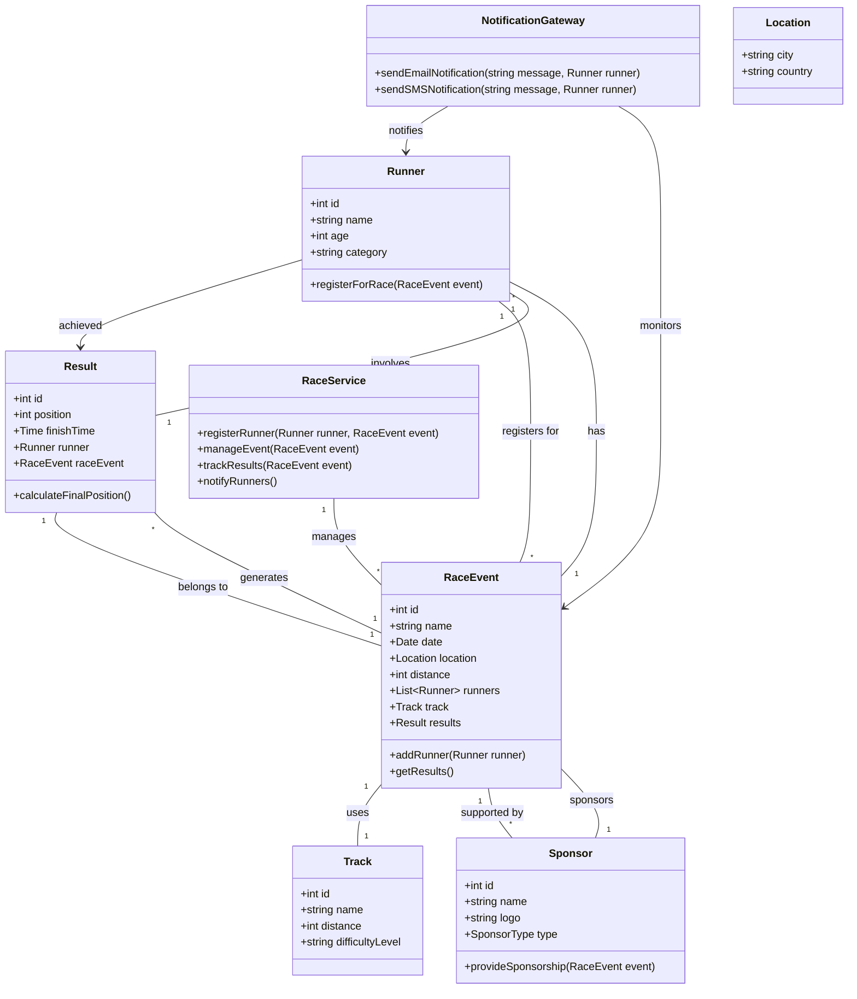

# EventStride

EventStride is an application designed to manage registrations of runners for races efficiently. It provides organizers with tools to handle participant data, race details, and payment processing seamlessly.

# Stack
1. Flask
2. MySQL
3. React with MUI

# Run
1. `docker-compose up --build`

# Design patterns
EventStride leverages several design patterns to create a scalable, maintainable, and user-friendly application. Below is a summary of the patterns currently implemented in the project:

## 1. Model-View-Controller (MVC)
- **Model:** Handles business logic and database interactions using Flask and SQLAlchemy.
- **View:** The React-based frontend manages the presentation layer, allowing users to interact with the application.
- **Controller:** Flask handles user requests, processes logic, and bridges the model and view layers.

## 2. Active Record
SQLAlchemy, an Object-Relational Mapping (ORM) library, is used to implement the Active Record pattern:
- Each database table is mapped to a Python class.
- Instances of these classes represent rows in the table.

## 3. Unit of Work
- To manage nested addition - `server/service/unitofwork.py`

## 4. Data Mapper
- To decouple model data from return data in api - `server/domain`

## 5. Server Session State
in-app session storage (flask-session)

### How it works

