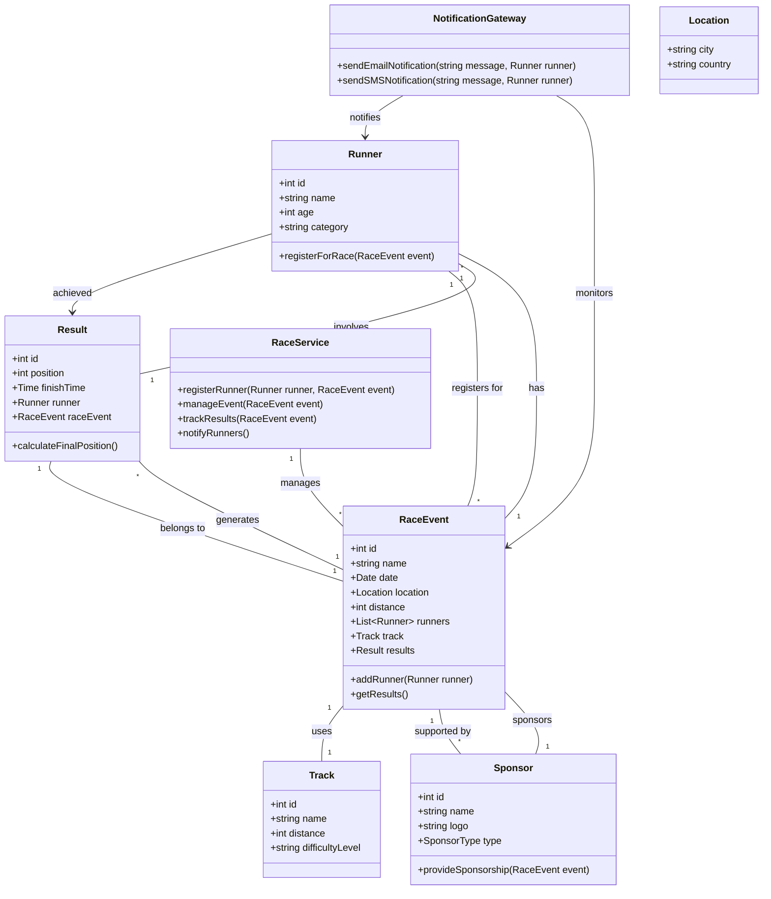

```mermaid
classDiagram
    class Runner {
        +int id
        +string name
        +int age
        +string category
        +registerForRace(RaceEvent event)
    }

    class RaceEvent {
        +int id
        +string name
        +Date date
        +Location location
        +int distance
        +List~Runner~ runners
        +Track track
        +Result results
        +addRunner(Runner runner)
        +getResults()
    }

    class Track {
        +int id
        +string name
        +int distance
        +string difficultyLevel
    }

    class Sponsor {
        +int id
        +string name
        +string logo
        +SponsorType type
        +provideSponsorship(RaceEvent event)
    }

    class Result {
        +int id
        +int position
        +Time finishTime
        +Runner runner
        +RaceEvent raceEvent
        +calculateFinalPosition()
    }

    class NotificationGateway {
        +sendEmailNotification(string message, Runner runner)
        +sendSMSNotification(string message, Runner runner)
    }

    class RaceService {
        +registerRunner(Runner runner, RaceEvent event)
        +manageEvent(RaceEvent event)
        +trackResults(RaceEvent event)
        +notifyRunners()
    }

    class Location {
        +string city
        +string country
    }

    Runner --> Result : achieved
    Runner "1" -- "*" RaceEvent : registers for
    RaceEvent "1" -- "*" Runner : has
    RaceEvent "1" -- "1" Track : uses
    RaceEvent "1" -- "*" Result : generates
    RaceEvent "1" -- "*" Sponsor : supported by
    Sponsor "1" -- "*" RaceEvent : sponsors
    Result "1" -- "1" Runner : involves
    Result "1" -- "1" RaceEvent : belongs to
    RaceService "1" -- "*" RaceEvent : manages
    NotificationGateway --> Runner : notifies
    NotificationGateway --> RaceEvent : monitors
```